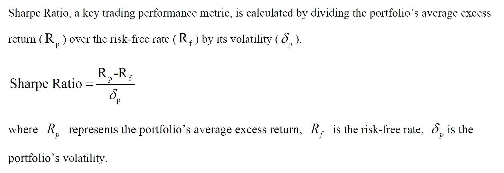
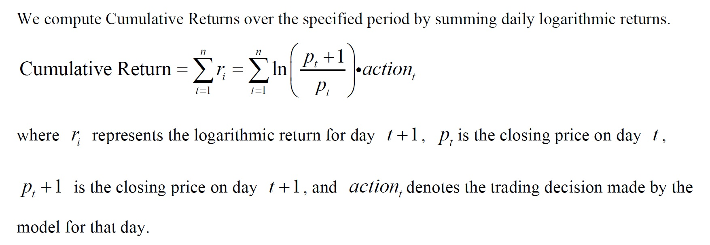
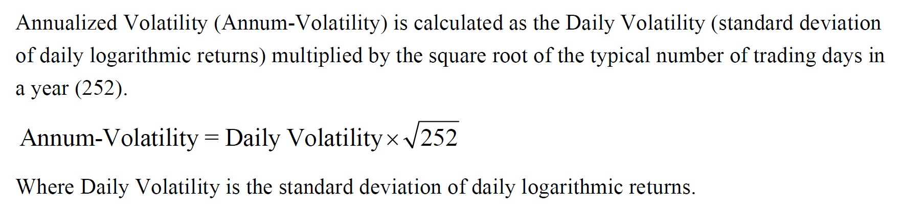
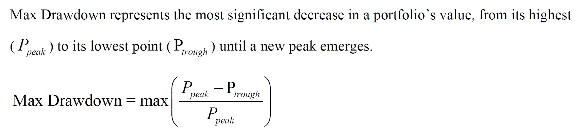
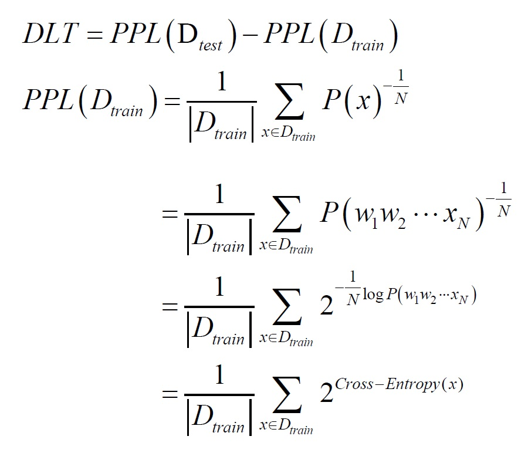

# IJCAI2024-challenge starter-kit

We're pleased to invite you to attend the IJCAI2024-challenge, ["Financial Challenges in Large Language Models - FinLLM"](https://sites.google.com/nlg.csie.ntu.edu.tw/finnlp-agentscen/shared-task-finllm).

## Outline
  - [Task 1 Financial Classification Starter Kit](#task-1-financial-classification-starter-kit)
  - [Task 2 Financial Text Summarization Starter Kit](#task-2-financial-text-summarization-starter-kit)
  - [Task 3 Single Stock Trading Starter Kit](#task-3-single-stock-trading-starter-kit)
  - [Fine Tune](#fine-tune)
  - [Model Cheating Detection](#Model-Cheating-Detection)

## Task 1 Financial Classification Starter Kit
### Introduction
This task focuses on argument unit classification to test the capabilities of LLMs to identify and categorize texts as premises or claims. Participants receive a financial text and two options, followingly design the prompt query template, and then classify the text as a claim or premise.

We provide 7.75k training data and 969 test data to categorize sentences as claims or premises. 

We use the following prompt template to ask and ask the question in this task.

Instruction: [task prompt] Text: [input text] Response: [output]

[input text] denotes the financial text in the prompt, [output] is the classified label  (i.e., "Claim" or "Premise"). 

### Performance Metrics
We use two metrics to evaluate classification capability, like F1 and Accuracy. 
We use F1 score as the final ranking metrics.

### Evaluation
You can follow the instructions in the [script](https://github.com/The-FinAI/PIXIU/blob/main/Finarg-ecc-auc%2BEdtsum_evaluation_sample.ipynb) to do evaluations on Task 1: financial classification.

### Dataset Example
| id |	query |	answer |	text	| choices	| gold |
| -- | ----- | ------ | ---- | ------- | ---- |
| finargeccauc0 | Analyze sentences from earnings conference calls and identify their argumentative function. Each sentence is either a premise, offering evidence or reasoning, or a claim, asserting a conclusion or viewpoint. Return only premise or claim. Text: I mean, sometimes it's not that you came up with some brilliant strategy, it's just like really good work consistently over a long period of time. Answer:	| premise | I mean, sometimes it's not that you came up with some brilliant strategy, it's just like really good work consistently over a long period of time. | [ "premise", "claim" ] | 0 |
| finargeccauc1 | Analyze sentences from earnings conference calls and identify their argumentative function. Each sentence is either a premise, offering evidence or reasoning, or a claim, asserting a conclusion or viewpoint. Return only premise or claim. Text: Even while in International, we're continuing to invest in a lot of areas, we continue to frontload Prime benefits for the newer geographies, we continue to launch new countries as we launch Prime in Australia recently. Answer: | claim | Even while in International, we're continuing to invest in a lot of areas, we continue to frontload Prime benefits for the newer geographies, we continue to launch new countries as we launch Prime in Australia recently. | [ "premise", "claim" ] | 1 |

## Task 2 Financial Text Summarization Starter Kit
### Introduction
This task is designed to test the capabilities of LLMs to generate coherent summaries [3]. Participants need to summarize a corresponding concise text according to the given financial news text, following the designed prompt template of query. 

We provide 8k training data and 2k test data for abstracting financial news articles into concise summaries.  

We use the following prompt template to ask and ask the question in this task.

Instruction: [task prompt] Context: [input context] Response: [output]

[input text] denotes the multiple-sentence text in financial news article, [output] is the abstractive summarization on this text.

### Performance Metrics
We utilize three metrics, such as ROUGE (1, 2, and L) and BERTScore, to evaluate generated summaries in terms of Relevance.  
We use ROUGE -1 score as the final ranking metrics.

### Evaluation
You can follow the instructions in the [script](https://github.com/The-FinAI/PIXIU/blob/main/Finarg-ecc-auc%2BEdtsum_evaluation_sample.ipynb) to do evaluations on Task 2: financial text summarization.

### Dataset Example
| id |	query |	answer | text |
| -- | ----- | ------ | ---- |
| edtsum0 | You are given a text that consists of multiple sentences. Your task is to perform abstractive summarization on this text. Use your understanding of the content to express the main ideas and crucial details in a shorter, coherent, and natural sounding text. Text: MONROE, Conn., Dec. 16, 2020 /PRNewswire/ --Elidah, maker of ELITONE, a home-use treatment for incontinence, announced it was selected out of 7500 entries from 159 countries to win a Top Ten award from the global SLINGSHOT 2020 start-up competition. Elidah was the only company from the United States awarded this distinction, and one of two start-ups in the life science category.Normally held in Singapore,this year the event was virtual and offered a record $750,000 in cash prizes by StartUpSG. One hundred companies pitched at the live event, and from those ten finalists were selected. The award winners included start-ups from all over the world including Israel, United Kingdom, Singapore, and India, among others. Continue Reading Gloria Kolb holding ELITONE Elidah "We sometimes have the mindset that successful start-ups must come from Silicon Valley," said Gloria Kolb, co-founder and CEO of Elidah, "but innovation is flourishing in the rest of the world as entrepreneurial support systems expand. I was impressed by the other finalists, advancing technologies such as biometric security, artificial intelligence, and gene editing." Although the top prize went to another start-up, Ms. Kolb, as the only female entrepreneur in the finals, was happy to see a company focused on women's health receive recognition. "Women's health should not be a taboo subject, and I hope that investors realize it presents a large market, ripe for innovation." ELITONE is the first home-health device that performs the hard-to-do pelvic floor exercises for women. It operates externally, without the invasiveness of vaginal probes. Exercises are needed to tone the pelvic floor muscles, but they can be hard to do correctly. The wearable nature of ELITONE allows women to do other activities while getting treatment at home, saving time, cost, and risk of infection. In a time when the clinics and pelvic floor physical therapy offices have shut down, at-home over-the-counter devices like ELITONE provide much-needed access to effective FDA-cleared treatments. About ElidahElidah is a women-owned FemTech company established to develop technologies that integrate recent advances in wearable devices, biomaterials, and mobile interfaces to deliver innovative therapeutic solutions.Elidah is led by entrepreneur Gloria Kolb, Founder and CEO, an MIT and Stanford trained engineer whose previous accolades include Boston's 40 under 40 and MIT Technology Review's World Top Innovators Under 35 (TR35). To learn more visit elitone.com.Contact: Gloria Kolb[emailprotected] 810 Main St., Ste C, Monroe, CT 06468978-435-4324SOURCE Elidah Answer: | Elidah Becomes the Only US Company to Win a Top Ten Prize in a Global Start-up Competition, Advancing Recognition for Women's Health | MONROE, Conn., Dec. 16, 2020 /PRNewswire/ --Elidah, maker of ELITONE, a home-use treatment for incontinence, announced it was selected out of 7500 entries from 159 countries to win a Top Ten award from the global SLINGSHOT 2020 start-up competition. Elidah was the only company from the United States awarded this distinction, and one of two start-ups in the life science category.Normally held in Singapore,this year the event was virtual and offered a record $750,000 in cash prizes by StartUpSG. One hundred companies pitched at the live event, and from those ten finalists were selected. The award winners included start-ups from all over the world including Israel, United Kingdom, Singapore, and India, among others. Continue Reading Gloria Kolb holding ELITONE Elidah ""We sometimes have the mindset that successful start-ups must come from Silicon Valley,"" said Gloria Kolb, co-founder and CEO of Elidah, ""but innovation is flourishing in the rest of the world as entrepreneurial support systems expand. I was impressed by the other finalists, advancing technologies such as biometric security, artificial intelligence, and gene editing."" Although the top prize went to another start-up, Ms. Kolb, as the only female entrepreneur in the finals, was happy to see a company focused on women's health receive recognition. ""Women's health should not be a taboo subject, and I hope that investors realize it presents a large market, ripe for innovation."" ELITONE is the first home-health device that performs the hard-to-do pelvic floor exercises for women. It operates externally, without the invasiveness of vaginal probes. Exercises are needed to tone the pelvic floor muscles, but they can be hard to do correctly. The wearable nature of ELITONE allows women to do other activities while getting treatment at home, saving time, cost, and risk of infection. In a time when the clinics and pelvic floor physical therapy offices have shut down, at-home over-the-counter devices like ELITONE provide much-needed access to effective FDA-cleared treatments. About ElidahElidah is a women-owned FemTech company established to develop technologies that integrate recent advances in wearable devices, biomaterials, and mobile interfaces to deliver innovative therapeutic solutions.Elidah is led by entrepreneur Gloria Kolb, Founder and CEO, an MIT and Stanford trained engineer whose previous accolades include Boston's 40 under 40 and MIT Technology Review's World Top Innovators Under 35 (TR35). To learn more visit elitone.com.Contact: Gloria Kolb[emailprotected] 810 Main St., Ste C, Monroe, CT 06468978-435-4324SOURCE Elidah |

## Task 3 Single Stock Trading Starter Kit
### Introduction
This task aims to evaluate LLMs’ ability to make sophisticated decisions in trading activities, which is currently restricted by human’s limited ability to process large volumes of data rapidly. Participants receive a combination of open-source data for stocks and an ETF. The system should output one of the three trading decisions (“buy”, “sell”, “hold”) with reasonings. 

We provide 291 data to evaluate LLMs on sophisticated stock Decisions. 

We use the following prompt template to ask and ask the question in this task.

Instruction: [task prompt] Context: [input context] Response: [output]

[input text] denotes the financial investment information in the prompt, [output] should strictly conform the following JSON format without any additional contents: {"investment_decision": string, "summary_reason": string, "short_memory_index": number, "middle_memory_index": number, "long_memory_index": number,  "reflection_memory_index": number}

### Performance Metrics
We offer a comprehensive assessment of profitability, risk management, and decision-making prowess by a series of metrics, such as Sharpe Ratio (SR), Cumulative Return (CR), Daily (DV) and Annualized volatility (AV), and Maximum Drawdown (MD). 

We use Sharpe Ratio (SR) score as the final ranking metrics.

The formulas are as follows: 

### Evaluation
You can follow the [instructions](https://github.com/The-FinAI/PIXIU?tab=readme-ov-file#finmem-a-performance-enhanced-llm-trading-agent) to do evaluations on Task 3: single stock trading.

### Dataset Example
| id | date	| price	| filing_k | filing_q |	news |
| -- | ---- | ----- | -------- | -------- | ---- |
| jnj_test0 | "2020-10-09" | { "DRIV": 17.52210235595703 } | { "FORM": "null" } | { "FORM": "null" } | { ""DRIV"": [ ""The global cloud enterprise content management market is expected to reach \\$62.4 billion by 2027, driven by a CAGR of 25.6% and significant growth in the U.S. and China. The positive score for this news is 2.3659735504111268e-08. The neutral score for this news is 0.9999990463256836. The negative score for this news is 9.636863751438796e-07."", ""The global emergency lighting batteries market is expected to reach \\$2.8 billion by 2027, growing at a CAGR of 10.8% despite the COVID-19 pandemic's impact. The positive score for this news is 1.1662441465887241e-05. The neutral score for this news is 0.9995514750480652. The negative score for this news is 0.000436866597738117."", ""Despite the impact of the COVID-19 pandemic, the global market for two-wheeler spark plugs is expected to reach 86.2 million units by 2027, growing at a CAGR of 4.9%. The positive score for this news is 1.1285221262369305e-05. The neutral score for this news is 0.9988551139831543. The negative score for this news is 0.0011336031602695584."", ""Despite pandemic setbacks, the global market for two-wheeler upside-down forks is expected to reach 701.8 thousand units by 2027, driven by growth in China and the U.S. The positive score for this news is 9.909140175068387e-08. The neutral score for this news is 0.9999970197677612. The negative score for this news is 2.81238385468896e-06."", ""The global embedded analytics market is expected to reach \\$84.6 billion by 2027, driven by a 13% CAGR, with cloud-based solutions leading the growth. The positive score for this news is 6.070506231026229e-08. The neutral score for this news is 0.9999868869781494. The negative score for this news is 1.2994331882509869e-05."", ""Despite the COVID-19 pandemic, the global battery monitoring system market is expected to reach \\$9.8 billion by 2027, with significant growth in the US and China. The positive score for this news is 4.437213263486228e-08. The neutral score for this news is 0.9999984502792358. The negative score for this news is 1.6080473415058805e-06."", ""Despite the impact of the COVID-19 pandemic, the global microwave transmission equipment market is expected to reach \\$6.7 billion by 2027, with a CAGR of 3.2%. The positive score for this news is 0.00034257289371453226. The neutral score for this news is 0.004475872032344341. The negative score for this news is 0.9951815009117126."", ""Despite the impact of the COVID-19 pandemic, the global transfer membrane market is expected to reach \\$200.3 million by 2027, with the PVDF segment leading the growth. The positive score for this news is 1.5521750640346e-07. The neutral score for this news is 0.9999940395355225. The negative score for this news is 5.781918389402563e-06."", ""Despite the impact of COVID-19, the global thermal analysis market is expected to reach \\$739.1 million by 2027, with a CAGR of 4.4%. The positive score for this news is 0.00015923684986773878. The neutral score for this news is 0.0002189901570091024. The negative score for this news is 0.9996217489242554."" ] } |

## Fine-tune
We recommand you to use [AutoTrain-Advanced](https://github.com/huggingface/autotrain-advanced.git) to train your models.

## Model Cheating Detection
To measure the risk of data leakage from the test set used in the training of a model, the Model Cheating, we have developed a new metric called the Data Leakage Test (DLT), building on existing research.

The DLT calculates the difference in perplexity of the large language models (LLMs) on both the training and test data to determine its data generation tendencies. Specifically, we separately input the training set and the test set into the LLMs, and calculate the perplexity on the training set (ppl-on-train) and the perplexity on the test set (ppl-on-test). The DLT value is then computed by subtracting the ppl-on-train from the ppl-on-test. A larger difference implies that the LLM is less likely to have seen the test set during training compared to the training set and suggests a lower likelihood of the model cheating. Conversely, a smaller difference implies that the LLM is more likely to have seen the test set during training and suggests a higher likelihood of the model cheating.

In the detection process, we will calculate the DLT values for some LLMs to establish a reference baseline of Model Cheating, and minimize the impact of generalization on the metric. The formula is as follows:

